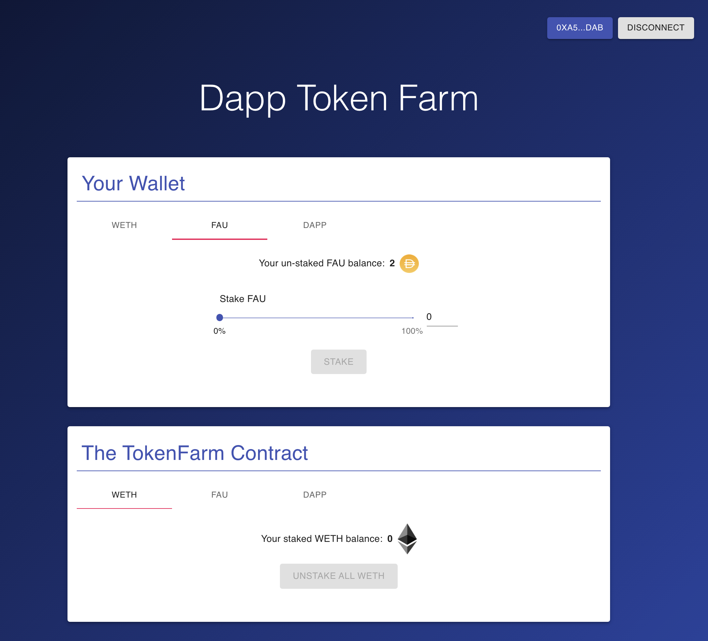

# defi-stake-yield-brownie

<br/>
<p align="center">
<a href="https://chain.link" target="_blank">

</a>
</p>
<br/>

## Summary
This is a repo to build your own full stack defi staking application for yield farming, borrowing and lending, or any other project you can think of. It allows you to:

- `stakeTokens`: Add any approved token to the farming contract for yeild farming, collateral, or whatever you want to do.
- `unStakeTokens`: Remove your tokens from the contract.
- `getUserTotalValue`: Get the total value that users have supplied based on calculations from the Chainlink Price Feeds.
- `issueTokens`: Issue a reward to the users staking on your platform!

And more!

- [defi-stake-yield-brownie](#defi-stake-yield-brownie)
  - [Summary](#summary)
  - [Prerequisites](#prerequisites)
  - [Installation](#installation)
- [Useage](#useage)
  - [Scripts](#scripts)
  - [Front end](#front-end)
  - [Testing](#testing)
  - [Linting](#linting)
- [Resources](#resources)
- [License](#license)

## Prerequisites

Please install or have installed the following:

- [nodejs and npm](https://nodejs.org/en/download/)
- [python](https://www.python.org/downloads/)
## Installation

1. [Install Brownie](https://eth-brownie.readthedocs.io/en/stable/install.html), if you haven't already. Here is a simple way to install brownie.

```bash
pip install --user pipx
pipx ensurepath
# restart your terminal
pipx install eth-brownie
```
Or if you can't get `pipx` to work, via pip (it's recommended to use pipx)
```bash
pip install eth-brownie
```

2. Clone this repo
```
git clone https://github.com/PatrickAlphaC/defi-stake-yield-brownie
cd defi-stake-yield-brownie
```

1. [Install ganache-cli](https://www.npmjs.com/package/ganache-cli)

```bash
npm install -g ganache-cli
```

If you want to be able to deploy to testnets, do the following.

4. Set your environment variables

Set your `WEB3_INFURA_PROJECT_ID`, and `PRIVATE_KEY` [environment variables](https://www.twilio.com/blog/2017/01/how-to-set-environment-variables.html).

You can get a `WEB3_INFURA_PROJECT_ID` by getting a free trial of [Infura](https://infura.io/). At the moment, it does need to be infura with brownie. You can find your `PRIVATE_KEY` from your ethereum wallet like [metamask](https://metamask.io/).

You'll also need testnet rinkeby or Kovan ETH and LINK. You can get LINK and ETH into your wallet by using the [rinkeby faucets located here](https://docs.chain.link/docs/link-token-contracts#rinkeby). If you're new to this, [watch this video.](https://www.youtube.com/watch?v=P7FX_1PePX0)

You'll also want an [Etherscan API Key](https://etherscan.io/apis) to verify your smart contracts.

You can add your environment variables to the `.env` file:
```bash
export WEB3_INFURA_PROJECT_ID=<PROJECT_ID>
export PRIVATE_KEY=<PRIVATE_KEY>
export ETHERSCAN_TOKEN=<YOUR_TOKEN>
```
> DO NOT SEND YOUR KEYS TO GITHUB
> If you do that, people can steal all your funds. Ideally use an account with no real money in it.

# Useage

## Scripts

```bash
brownie run scripts/deploy.py
```
This will deploy the contracts, depoly some mock Chainlink contracts for you to interact with.
```bash
brownie run scripts/deploy.py --network kovan
```
This will do the same thing... but on Kovan.

```shell
(base) ➜  stake_dapp git:(main) ✗ brownie run scripts/deploy.py --network kovan
Brownie v1.19.0 - Python development framework for Ethereum

StakeDappProject is the active project.

Running 'scripts/deploy.py::main'...
Transaction sent: 0xb504dcf672ca8507f4ea201f216971e0cec7086313e1b5e91020d3df6a7dfd02
  Gas price: 2.500000007 gwei   Gas limit: 702680   Nonce: 10
  DappToken.constructor confirmed   Block: 32134107   Gas used: 638800 (90.91%)
  DappToken deployed at: 0x80D026fd3C908134e6B37912DbaAb412889b6d33

Transaction sent: 0x8f1a89ca8c15eadd711a43efe8ebdca9a817ac4edce48c863e2f728808331fc3
  Gas price: 2.500000007 gwei   Gas limit: 1179933   Nonce: 11
  TokenFarm.constructor confirmed   Block: 32134110   Gas used: 1072667 (90.91%)
  TokenFarm deployed at: 0xBa62a1CB0a751fbf2c081bBac415B426820E21AB

Waiting for https://api-kovan.etherscan.io/api to process contract...
Verification submitted successfully. Waiting for result...
Verification complete. Result: Already Verified
Transaction sent: 0xd45a4c5d68e3779c451af4dc877c33f15aae1de43eac25ed1a4311796a7f63cb
  Gas price: 2.500000007 gwei   Gas limit: 56769   Nonce: 12
  DappToken.transfer confirmed   Block: 32134118   Gas used: 51609 (90.91%)

  DappToken.transfer confirmed   Block: 32134118   Gas used: 51609 (90.91%)

Transaction sent: 0x8e2d8ca1a7dcdbe7fe65837be0bfbe20d9e2e71d7107e16d36b3f09cedf22744
  Gas price: 2.500000007 gwei   Gas limit: 75071   Nonce: 13
  TokenFarm.addAllowedTokens confirmed   Block: 32134121   Gas used: 68247 (90.91%)

Transaction sent: 0x255327e3497298a1e3afd9d9a8b4d919cacd1d28bd246457fce15c9077331860
  Gas price: 2.500000007 gwei   Gas limit: 51286   Nonce: 14
  TokenFarm.setPriceFeedContract confirmed   Block: 32134124   Gas used: 46624 (90.91%)

  TokenFarm.setPriceFeedContract confirmed   Block: 32134124   Gas used: 46624 (90.91%)

Transaction sent: 0x1c82e907059156a565cfe3ebc013b2e3e2ca2ff3adcd9870098dcd9926b51c85
  Gas price: 2.500000007 gwei   Gas limit: 56248   Nonce: 15
  TokenFarm.addAllowedTokens confirmed   Block: 32134126   Gas used: 51135 (90.91%)

Transaction sent: 0x85e3a17d06760eeed444473ff9624aadfd1a5b48dec3fdefd3eedd9bc58b5b62
  Gas price: 2.500000007 gwei   Gas limit: 51273   Nonce: 16
  TokenFarm.setPriceFeedContract confirmed   Block: 32134127   Gas used: 46612 (90.91%)

  TokenFarm.setPriceFeedContract confirmed   Block: 32134127   Gas used: 46612 (90.91%)

Transaction sent: 0x520f34d12a22b5eb0ef82669da019e550cf0e4370879d5b076a698d9334bf128
  Gas price: 2.500000007 gwei   Gas limit: 56261   Nonce: 17
  TokenFarm.addAllowedTokens confirmed   Block: 32134129   Gas used: 51147 (90.91%)

Transaction sent: 0x90cdd46fd1f197e5dab4c03e891df6ac37727572a057411f0a47494090122b24
  Gas price: 2.500000007 gwei   Gas limit: 51286   Nonce: 18
  TokenFarm.setPriceFeedContract confirmed   Block: 32134131   Gas used: 46624 (90.91%)

  TokenFarm.setPriceFeedContract confirmed   Block: 32134131   Gas used: 46624 (90.91%)

Updating front end...
Front end updated!
```

My DAPP token is deployed in `0x80D026fd3C908134e6B37912DbaAb412889b6d33`

## Front end
```bash
cd front_end
yarn
yarn start
```
and you'll be able to interact with the UI

## Testing

```
brownie test
```

## Linting

```
pip install black
pip install autoflake
autoflake --in-place --remove-unused-variables -r .
black .
```

# Resources

To get started with Brownie:

* [Chainlink Documentation](https://docs.chain.link/docs)
* Check out the [Chainlink documentation](https://docs.chain.link/docs) to get started from any level of smart contract engineering.
* Check out the other [Brownie mixes](https://github.com/brownie-mix/) that can be used as a starting point for your own contracts. They also provide example code to help you get started.
* ["Getting Started with Brownie"](https://medium.com/@iamdefinitelyahuman/getting-started-with-brownie-part-1-9b2181f4cb99) is a good tutorial to help you familiarize yourself with Brownie.
* For more in-depth information, read the [Brownie documentation](https://eth-brownie.readthedocs.io/en/stable/).
* [Create React App](https://create-react-app.dev/docs/adding-typescript/) for front end fun
* [Materials-UI](https://material-ui.com/)

Shoutout to [Matt Durkin](https://twitter.com/mdurkin92) on twitter for creating the UI!
Shoutout to [Gregory from Dapp University](https://www.dappuniversity.com/) for the inspiration for this!

Any questions? Join our [Discord](https://discord.gg/2YHSAey) or open an issue.

# License

This project is licensed under the [MIT license](LICENSE).
